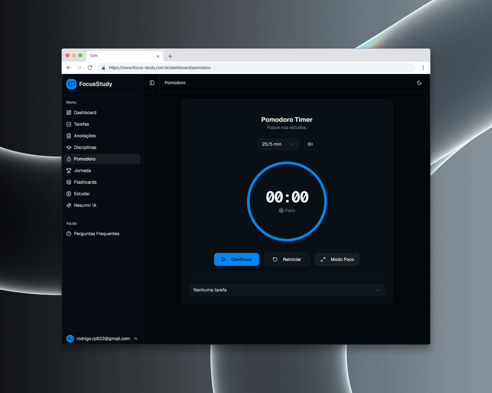
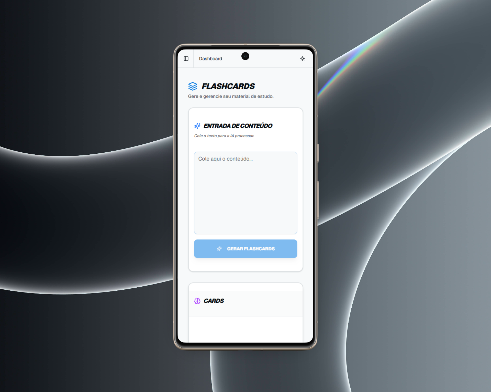

# 📚 FocusStudy

> **Aumente seu foco, organize sua rotina e domine seus estudos.**

[](https://nextjs.org/)
[](https://supabase.com/)
[](https://tailwindcss.com/)
[](https://www.typescriptlang.org/)
[](https://creativecommons.org/licenses/by-nc-nd/4.0/)

**Acesse o projeto:** [https://www.focus-study.com.br/](https://www.focus-study.com.br/)

---

## 📸 Screenshots do Projeto

### Desktop


### Mobile


---

## 🎯 Sobre o FocusStudy

O FocusStudy é uma plataforma Full Stack projetada para transformar a rotina de concurseiros e estudantes de alto rendimento. Através de uma interface minimalista e sem distrações, o app centraliza o gerenciamento de carga horária, anotações e execução de tarefas.

### 🌟 Diferenciais

- **🌓 Dual Theme:** Suporte completo a Modo Escuro (Dark) e Claro (Light) para conforto visual em longas sessões de estudo.
- **🔒 Auth Híbrida:** Login seguro via e-mail ou **Google OAuth** via Supabase Auth.
- **🏗️ Arquitetura Robusta:** Desenvolvido com **Clean Code** e tipagem rigorosa em TypeScript.
- **⚡ Performance:** Server-side rendering com Next.js para carregamento instantâneo.

---

## 🛠️ Stack Tecnológica

- **Frontend:** Next.js 14+ (App Router), React, Lucide Icons.
- **Estilização:** Tailwind CSS + Shadcn/UI (Componentes acessíveis).
- **Backend-as-a-Service:** **Supabase** (PostgreSQL, Auth, RLS).
- **Gerenciamento de Estado:** Hooks customizados e Supabase Realtime.

---

## 📐 Estrutura do Projeto (Arquitetura)

O projeto segue uma estrutura modular focada em escalabilidade:

```bash
app/
├── auth/callback/   # Manipulação de tokens OAuth
├── dashboard/       # Núcleo da aplicação (Disciplinas, Pomodoro, Notas)
├── login/ & register/ # Fluxos de autenticação
├── terms/ & privacy/  # Páginas legais e conformidade
components/
├── dashboard/       # Cards de estatísticas e gráficos
├── disciplines/     # Gestão de matérias (Create/Edit Dialogs)
├── notes/           # Editor de notas e listagens
├── pomodoro/        # Timer funcional
├── ui/              # Biblioteca de componentes base (Shadcn)
lib/
└── supabase/        # Configurações de Client, Server e Proxy

```

## 👤 Autor

**Rodrigo Costa**

- GitHub: [@Rodrigopcosta](https://github.com/Rodrigopcosta)
- LinkedIn: [in/rodrigopc-developer](https://www.linkedin.com/in/rodrigopc-developer)
- Portfolio: [rodrigopcosta.github.io](https://rodrigopcosta.github.io)

Desenvolvido com foco em performance e simplicidade. 🚀
